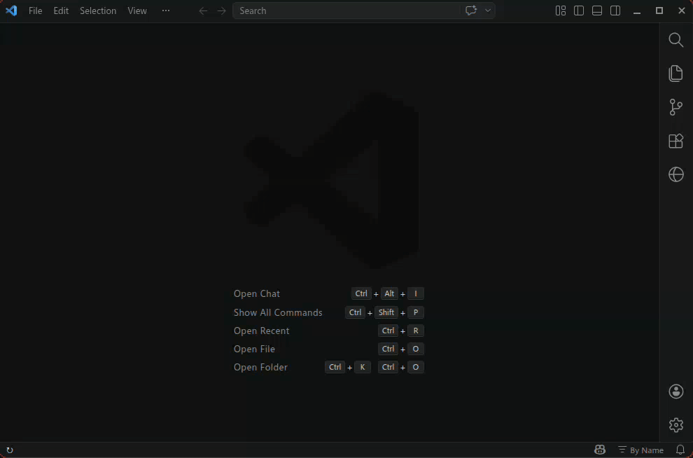

# Integrated Browser Activity Bar Button with Bookmarks

Adds a `Browser` icon to the Activity Bar and opens VS Code's built-in Integrated Browser (introduced in v1.109, January 2026) with bookmark support.

[](media/integrated-browser-bookmarks-to-activity-bar.mp4)

If the demo does not play inline, open or download the video: [Demo video](media/integrated-browser-bookmarks-to-activity-bar.mp4).

### Features

- **Activity Bar integration**: Quick access to the browser from the sidebar.
- **Bookmarks**: Save favorite tabs with custom names.
- **Local HTML support**: Absolute filesystem paths are converted to valid `file:` URLs before opening.
- **Clipboard local-file opener**: The `Open Local File from Clipboard` button opens a local file path from the clipboard as a proper `file:` URL.
- **Explorer and tab actions**: Open local HTML files directly from Explorer, from an editor tab context menu, or from an editor title-bar button.
- **Persistent storage**: Favorites persist across VS Code sessions.
- **One-click open**: Launch saved sites directly from the sidebar.

### Usage

1. Click the `Browser` icon in the Activity Bar.
2. Click the `Open Local File from Clipboard` button in the sidebar title to open the current clipboard contents when it contains an absolute local file path or a `file://` URL.
3. Click the `+` button in the sidebar title to add a favorite.
    - Enter the URL (for example, `https://google.com`).
    - Enter a descriptive name (for example, `Google`).
4. Click any favorite to open it in the integrated browser.
5. Click the trash icon to delete a favorite.
6. Click the globe button in the editor title bar when an HTML tab is active to open that page in the integrated browser.
7. Right-click a local `.html`, `.htm`, or `.xhtml` file in Explorer or on an editor tab and choose `Open HTML File in Integrated Browser`.

You can also paste an absolute local path such as `/mnt/merged_ssd/WILLCLOUD/willcloud_application_structure.html`; the extension now opens it as a `file:` URI instead of rewriting it to `http://...`.

The clipboard button is useful when the integrated browser's own address bar rewrites a pasted local path to `http://...`.

### Testing & Packaging

- **To test**: Press `F5` to launch an Extension Development Host.
- **To package**:
   ```bash
    mkdir -p vsix
    npx @vscode/vsce package --allow-missing-repository --out vsix/
    ls -t vsix/*.vsix | tail -n +6 | xargs rm -f -- || true
    code --install-extension vsix/integrated-browser-on-activity-bar-0.0.13.vsix
   ```
